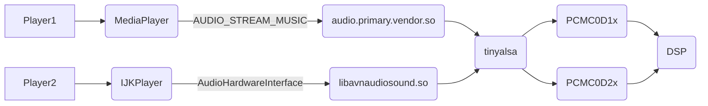

## 一、Android音频框架概述

### 1、Hardware层

**S/PDIF**(Sony/Philips Digital Interface Format)是一种数字传输接口，可使用光纤或同轴电缆输出，把音频输出至解码器上，能保持高保真度的输出结果。S/PDIF能以单线传输音频数据。

![SPDIF原理图][spdif_schematic_demo]

S/PDIF接口采用的是**IEC958**标准，该标准使用**BMC**(Biphase Mask Code)编码，其格式如下：

![IEC958编码][iec958_biphase_mask_encoding]

其原理是使用一个两倍于传输位率(Bit Rate)的Clock做为基准，把原本一位数据拆成两部份，当数据为1的时候在其时钟周期内转变一次电平(0->1或1->0)让Data变成两个不同电平的Data，变成10或01，而当Data为0时则不转变电平，变成11或00。同时每一个位开头的电平与前一个位结尾电平要不同，这样接收端才能判别每一个位的边界。

IEC958标准传输双声道信号的协议架构如下图所示，最上面为由192个帧(Frame)构成的块(Block)。而每个帧储存了两个声道的一组采样(Sample)，分为Channel A和Channel B两个声道，也就是说一个帧(Frame)包含两个子帧(Sub Frame)：

![IEC958数据块][iec958_one_block]

每组采样由一个子帧(Sub Frame)构成，子帧(Sub Frame)数据长度为32Bits，包含了帧头(Preamble)、辅助数据(Aux Data)、音频数据(Audio Data)和四位校验码(Checksum)：

![IEC958子帧][iec958_sub_frame]

也就是说，一个子帧(Sub Frame)为4 Bytes，一个帧(Frame)为8 Bytes，一个块(Block)为192x8=1536 Bytes。

**I2S**(Integrated Interchip Sound)是IC间传输数字音频数据的一种接口标准，采用串行的方式传输2组（左右声道）数据。

![I2S原理图][i2s_schematic_demo]

一般I2S包含如下几条传输线：

	1. 比特时钟 (BCLK: bit clock)
		标准名称为 连续串行时钟 (SCK: Continuous Serial Clock)
	2. 左右声道时钟 (LRCLK: left-right clock)
		标准名称为 字符选择 (WS: word select)，也称为 帧同步 (FS: Frame Sync)
		0表示左频道, 1表示右频道
	3. 串行数据 (SD: Serial Data)
		也称之为 复合数据 (SDATA: multiplexed data)，但也可称为SDATA，SDIN，SDOUT，DACDAT，ADCDAT..
		有一条或者多条串行数据线
	4. 主时钟 (MCLK: Master Clock)
		不是I2S标准的一部分，但通常应用以使音频 CODEC 芯片与主控制器之间能够更好的同步
		f_MCLK=256 x f_LRCLK 或者 f_MCLK=384 x f_LRCLK

![I2S时序图][i2s_timing]

I2S的数据是从高比特（MSB）发送至低比特（LSB），从`LRCLK`的左端开始，加上一个`BCLK`的延迟，即数据将比`LRCLK`要慢一个`BCLK`。也有左对齐（Left Justified）的I2S数据流，它没有`BCLK`的延迟，数据和`LRCLK`是同步的。右对齐（Right Justified）则是数据比`LRCLK`快一个`BCLK`。

![I2S常见时序图-OPENEDV][i2s-normal-timing-by-openedv]

随着技术的发展，在统一的 I2S 接口下，出现了不同的数据格式，根据 DATA 数据相对于`LRCLK`和`BCLK`位置的不同，出现了左对齐(Left Justified)和右对齐(Right Justified)两种格式，这两种格式的时序图如上*（左右声道标识错了）*。常用的是左对齐形式的时序。

---

**DAI/SSI/SAI/ESAI**是SOC中常用的I2S外设，只是根据不同的芯片厂商有不同的名字和含义。

**ASRC**


---

**PCM**(Pulse Code Modulation)脉冲编码调制

![PCM采样][pcm_quantization]

**DSD**(Direct Stream Digital)直接比特流数字

![DSD采样][dsd_quantization]


---

**Dolby**(Dolby Digital Surround)[杜比环绕声立体声](https://www.dolby.com/)

![杜比LOGO][dolby_logo]

**DTS**(DTS Digital Surround)[DTS环绕声立体声](https://dts.com/)

![DTS LOGO][dts_listen_logo]

---

参考文档：

[SPDIF数字传输接口](https://wenku.baidu.com/view/da86078271fe910ef12df8ea.html)

[I²S](https://en.wikipedia.org/wiki/I%C2%B2S)

[DSD vs PCM：迷思与真相](http://jandan.net/p/98105)

《【正点原子】I.MX6U嵌入式Linux驱动开发指南V1.5.pdf》

### 2、Linux层

**ALSA**(Advanced Linux Sound Architecture)模型

![ALSA软件体系结构][alsa_architecture_from_csdn]


---

**DAPM**(Dynamic Audio Power Management)

参考文档：

[Linux audio驱动模型](https://www.cnblogs.com/linhaostudy/p/8169383.html)

[alsa架构分析](https://blog.csdn.net/poltroon/article/details/7978304)

### 3、HAL层

在HAL层中，通过调用`tinyalsa`的方式，将Linux层的声卡文件节点封装为系统可调用的声卡动态库，如下：

```text
/system/lib/hw/audio.a2dp.default.so
/system/lib/hw/audio.usb.default.so
/system/lib/hw/audio.primary.default.so
/system/lib/hw/audio.primary.{vendor}.so
/system/lib/hw/audio.xxxx.{vendor}.so
```

以声卡`audio.primary.imx.so`源码为例：

```cpp
static struct hw_module_methods_t hal_module_methods = {
    .open = adev_open,
};

struct audio_module HAL_MODULE_INFO_SYM = {
    .common = {
        .tag = HARDWARE_MODULE_TAG,
        .module_api_version = AUDIO_MODULE_API_VERSION_0_1,
        .hal_api_version = HARDWARE_HAL_API_VERSION,
        .id = AUDIO_HARDWARE_MODULE_ID,
        .name = "NXP i.MX Audio HW HAL",
        .author = "The Android Open Source Project",
        .methods = &hal_module_methods,
    },
};
```

函数`adev_open`的功能主要是创建`adev`结构体并将其初始化：

```cpp
static int adev_open(const hw_module_t* module, const char* name,
                     hw_device_t** device)
{
    struct imx_audio_device *adev;
    ...
    // 申请内存创建adev
    adev = (struct imx_audio_device *)calloc(1, sizeof(struct imx_audio_device));
    if (!adev)
        return -ENOMEM;

    // 初始化adev中hw_device和其他成员
    adev->hw_device. ... = ....;
    ...
    adev->hw_device.open_output_stream      = adev_open_output_stream;
    ...
    adev->hw_device.open_input_stream       = adev_open_input_stream;
    ...
    // 读取声卡配置文件并选择可用设备
    parse_all_cards(audio_card_list);
    ret = scan_available_device(adev, true, true);
    ...
    // 上锁并设置默认音频路由通道
    pthread_mutex_lock(&adev->lock);
    for(i = 0; i < adev->audio_card_num; i++)
        set_route_by_array(adev->mixer[i], adev->card_list[i]->init_ctl, 1);
    ...
    // 设置当前声卡默认支持的设备
    adev->out_device = AUDIO_DEVICE_OUT_SPEAKER;
    adev->in_device  = AUDIO_DEVICE_IN_BUILTIN_MIC & ~AUDIO_DEVICE_BIT_IN;
    select_output_device(adev);
    ...
    // 解锁并将adev指针赋值到形参
    pthread_mutex_unlock(&adev->lock);
    ...
    *device = &adev->hw_device.common;
    ...
}
```

注意到结构体`adev`中成员的分布如下：

```cpp
// audio_hardware.h
struct imx_audio_device {
    struct audio_hw_device hw_device;
    pthread_mutex_t lock;
    ...
}
```

`**device`获取的其实就是`adev`的地址，后文中对于该指针的强制类型转换也是可行的：

```cpp
// hardware/libhardware/include/hardware/audio.h
struct audio_hw_device {
    struct hw_device_t common;
    ...
    int (*open_output_stream)(struct audio_hw_device *dev,
                              audio_io_handle_t handle,
                              audio_devices_t devices,
                              audio_output_flags_t flags,
                              struct audio_config *config,
                              struct audio_stream_out **stream_out,
                              const char *address);
    ...
    int (*open_input_stream)(struct audio_hw_device *dev,
                             audio_io_handle_t handle,
                             audio_devices_t devices,
                             struct audio_config *config,
                             struct audio_stream_in **stream_in,
                             audio_input_flags_t flags,
                             const char *address,
                             audio_source_t source);
    ...
}
```

再看如何读取并解析声卡配置文件：

```cpp
bool parse_all_cards(struct audio_card **audio_card_list)
{
    ...
    // 打开默认文件夹 /vendor/etc/configs/audio
    vidDir = opendir(g_kAudioConfigPath);
    ...
    // 遍历文件夹
    while ((dirEntry = readdir(vidDir)) != NULL) {
        char config_file[PATH_MAX] = {0};
        // 判断当前文件后缀是否为json
        if(!strstr(dirEntry->d_name, ".json"))
            continue;
        // 生成路径并尝试解析配置文件
        snprintf(config_file, PATH_MAX, "%s/%s", g_kAudioConfigPath, dirEntry->d_name);
        parse_ok = parse_one_card(config_file, &audio_card_list[card_idx]);
        ...
    }
    ...
}
```

声卡配置文件是一个`JSON`文件，其具体格式可以参考[`device/fsl/common/audio-json/readme.txt`](https://source.codeaurora.org/external/imxat/ecockpit/device-fsl/tree/common/audio-json/readme.txt?h=ecockpit_10.0.0_2.1.0-dev)中的说明：

```json
{
    "driver_name": "wm8960-audio",
    "bus_name": "bus1_system_sound_out",
    "supported_out_devices": ["speaker", "wired_headphone", "bus"],
    "supported_in_devices": ["builtin_mic", "wired_headset"],
}
```

其中`driver_name`是默认需要的，`bus_name`主要用于Android Automotive。如果用户自定义了相关输入输出设备，则需要在`audio_card_config_parse.cpp`中添加声明，否则会导致解析失败：

```cpp
static const struct audio_devcie_map g_out_device_map[] = {
    ...
    {"anlg_dock_headset", AUDIO_DEVICE_OUT_ANLG_DOCK_HEADSET},
    {"dgtl_dock_headset", AUDIO_DEVICE_OUT_DGTL_DOCK_HEADSET},
}
```

函数`adev_open_output_stream`的功能主要是创建并初始化`out`结构体，将其指针地址赋值到形参`**stream_out`中去：

```cpp
static int adev_open_output_stream(struct audio_hw_device *dev,
                                   audio_io_handle_t handle __unused,
                                   audio_devices_t devices,
                                   audio_output_flags_t flags,
                                   struct audio_config *config,
                                   struct audio_stream_out **stream_out,
                                   const char* address)
{
    struct imx_audio_device *ladev = (struct imx_audio_device *)dev;
    ...
    // 申请内存创建out
    out = (struct imx_stream_out *)calloc(1, sizeof(struct imx_stream_out));
    ...
    // 根据不同的Flag类型和设备类型配置为不同的参数
    if (flags & AUDIO_OUTPUT_FLAG_COMPRESS_OFFLOAD) {
        ALOGW("%s: compress offload stream", __func__);
        ...
    } else if (flags & AUDIO_OUTPUT_FLAG_DIRECT &&
               devices == AUDIO_DEVICE_OUT_AUX_DIGITAL) {
        ALOGW("adev_open_output_stream() HDMI multichannel");
        ...
    } else if (flags & AUDIO_OUTPUT_FLAG_DIRECT &&
              ((devices == AUDIO_DEVICE_OUT_SPEAKER) ||
               (devices == AUDIO_DEVICE_OUT_LINE) ||
               (devices == AUDIO_DEVICE_OUT_WIRED_HEADPHONE)) &&
               ladev->support_multichannel) {
        ALOGW("adev_open_output_stream() ESAI multichannel");
        ...
    } else {
        ALOGV("adev_open_output_stream() normal buffer");
        ...
    }
    ...
    // 初始化成员
    out->stream.write                       = out_write;
    ...
    // 对形参赋值
    *stream_out = &out->stream;
    ladev->active_output[output_type] = out;
}
```

`**stream_out`获取到的地址就是`out`的地址：

```cpp
// hardware/libhardware/include/hardware/audio.h
struct imx_stream_out {
    struct audio_stream_out stream;
    pthread_mutex_t lock;
    ...
}
```

函数`out_write`的主要功能就是将上层传来的数据通过`tinyalsa`传输到硬件声卡上去：

```cpp
static ssize_t out_write(struct audio_stream_out *stream, const void* buffer,
                         size_t bytes)
{
    struct imx_stream_out *out = (struct imx_stream_out *)stream;
    // 上锁
    pthread_mutex_lock(&adev->lock);
    pthread_mutex_lock(&out->lock);
    // 判断当前输出是否为待机模式
    if (out->standby) {
        // 打开PCM声卡设备
        ret = start_output_stream(out);
        ...
        // 退出待机模式
        out->standby = 0;
        ...
    }
    pthread_mutex_unlock(&adev->lock);
    ...
    // 判断PCM声卡设备是否打开成功
    if (out->pcm) {
        ...
        // 向PCM声卡设备写入数据
        ret = pcm_write_wrapper(out->pcm, (void *)buffer, bytes, out->write_flags);
        ...
    }
exit:
    pthread_mutex_unlock(&out->lock);
    ...
    return bytes;
}
```

在函数`start_output_stream`中主要实现根据相关参数对PCM声卡设备的选择，配置好参数后打开设备：

```cpp
static int start_output_stream(struct imx_stream_out *out)
{
    // 默认PORT = 0
    int card = -1;
    unsigned int port = 0;
    ...
    // 获取声卡编号
    card = get_card_for_device(adev, out->device, PCM_OUT, &out->card_index);
    ...
    // 打开声卡设备
    out->pcm = pcm_open(card, port, flags, config);
    ...
}
```

函数`get_card_for_device`则根据需要的设备类型，遍历所有支持的声卡中的配置数据，找到符合要求的声卡的编号：

```cpp
static int get_card_for_device(struct imx_audio_device *adev, int device, unsigned int flag, int *card_index)
{
    int i;
    int card = -1;

    if (flag == PCM_OUT ) {
        for(i = 0; i < adev->audio_card_num; i++) {
            // 查找匹配的输出声卡设备
            if(adev->card_list[i]->supported_out_devices & device) {
                  card = adev->card_list[i]->card;
                  break;
            }
        }
    } else {
        for(i = 0; i < adev->audio_card_num; i++) {
            // 查找匹配的输入声卡设备
            if(adev->card_list[i]->supported_in_devices & device & ~AUDIO_DEVICE_BIT_IN) {
                  card = adev->card_list[i]->card;
                  break;
            }
        }
    }
    if (card_index != NULL)
        *card_index = i;
    return card;
}
```

同理，也可以从`adev_open_input_stream`函数为入口追踪声卡是如何录音的。

### 4、Framwork层

**AT**(AudioTrack)

---

**AF**(AudioFlinger)

---

**AP**(AudioPolicy)

参考文档：

[第7章 深入理解Audio系统](https://www.kancloud.cn/alex_wsc/android_depp/412851)


### 5、Applicant层

采用`MediaPlayer`来测试音频播放：

```java
public boolean startPlayer(int index, int as_type, String ds) {
    player[index] = new MediaPlayer();
    boolean use_car_version = true;

    try {
        if (use_car_version) {
            player[index].setAudioStreamType(as_type);
        } else {
            int usage = AudioAttributes.USAGE_MEDIA;
            switch (as_type) {
                case AudioManager.STREAM_ALARM:
                    usage = AudioAttributes.USAGE_ALARM;
                    break;
                case AudioManager.STREAM_NOTIFICATION:
                    usage = AudioAttributes.USAGE_NOTIFICATION;
                    break;
                default:
                    usage = AudioAttributes.USAGE_MEDIA;
            }
            player[index].setAudioAttributes(new AudioAttributes.Builder()
                                             .setFlags(AudioAttributes.FLAG_AUDIBILITY_ENFORCED)
                                             .setLegacyStreamType(as_type)
                                             .setUsage(usage)
                                             .setContentType(AudioAttributes.CONTENT_TYPE_SONIFICATION)
                                             .build());
        }
        player[index].setDataSource(ds);
        player[index].prepare();
        player[index].start();
    } catch (IOException e) {
        e.printStackTrace();
        return false;
    }
    return true;
}
```

需要注意的是，在`Automotive`系统下，需要使用`setAudioAttributes`而不是`setAudioStreamType`。

## 二、多声卡方案概述

### 1、其他可参考方案

采用`IJKPlayer`直接调用HAL层中自定义的一个动态库。该动态库通过调用`tinyalsa`的方式，实现了对Linux声卡的基本操作：

```cpp
status_t AudioHardwareStub::open(void)
status_t AudioHardwareStub::close(void)
status_t AudioHardwareStub::start(void)
void AudioHardwareStub::stop(void)
ssize_t AudioHardwareStub::write(const void* buffer, size_t size)
ssize_t AudioHardwareStub::read(const void* buffer, size_t size)
void AudioHardwareStub::flush(void)
void AudioHardwareStub::pause(void)
void AudioHardwareStub::setSampleRate(int sampleRate)
void AudioHardwareStub::setChannelCount(int channel)
void AudioHardwareStub::setFrameSize(int framesize)
int AudioHardwareStub::getPcmFramesToBytes(void)
int AudioHardwareStub::getPcmBufferSize(void)
AudioHardwareInterface AudioHardwareStub::create(void)
```

用户在调用`IJKPlayer`创建播放器的时候，其音频通道已确定。多媒体输出情况下，如果因实际输出导致的与系统播放器之间存在复用音频的情况，往往需要APP应用实现开启、关闭播放器的操作，上层功能逻辑的实现往往会非常复杂。



### 2、声卡及音频流映射方案

| 流的类型 | 执行策略 | 输出设备 | 声卡设备 | 功能 |
| - | - | - | - | - |
|蓝牙电话| / | / | PCMC0D0 | / |
|AUDIO_STREAM_ALARM | STRATEGY_SUB | AUDIO_DEVICE_OUT_DGTL_DOCK_HEADSET | PCMC0D1 | 媒体1 |
|AUDIO_STREAM_NOTIFICATION | STRATEGY_MINOR | AUDIO_DEVICE_OUT_ANLG_DOCK_HEADSET | PCMC0D2 | 媒体2 |
|AUDIO_STREAM_MUSIC/SYSTEM | STRATEGY_MEDIA |	AUDIO_DEVICE_OUT_SPEAKER | PCMC0D3 | 导航 |


## 三、功能实现方案

### 1、Android4.4 方案实现

#### 修改配置文件

在`/system/etc/audio_policy.conf`中增加声卡`minor`和`sub`描述对象，以便于安卓系统初始化`Audio`部分时会根据`audio_policy.conf`自动加载`audio.minor.{vendor}.so`和`audio.sub.{vendor}.so`动态库文件：

```conf
# /path/to/sdk/device/telechips/{vendor}-common/audio_policy.conf
audio_hw_modules {
  primary {
    outputs {
      primary { ...
      }
      passthrough { ...
      }
    }
    inputs {
      primary { ...
      }
    }
  }
  minor {
    outputs {
      minor {
        sampling_rates 44100
        channel_masks AUDIO_CHANNEL_OUT_STEREO
        formats AUDIO_FORMAT_PCM_16_BIT
        devices AUDIO_DEVICE_OUT_SPEAKER|AUDIO_DEVICE_OUT_ANLG_DOCK_HEADSET
        flags AUDIO_OUTPUT_FLAG_DEEP_BUFFER
      }
    }
  }
  sub {
    outputs {
      sub {
        sampling_rates 44100
        channel_masks AUDIO_CHANNEL_OUT_STEREO
        formats AUDIO_FORMAT_PCM_16_BIT
        devices AUDIO_DEVICE_OUT_SPEAKER|AUDIO_DEVICE_OUT_DGTL_DOCK_HEADSET
        flags AUDIO_OUTPUT_FLAG_DEEP_BUFFER
      }
    }
  }
}
```

每个声卡中含有特定的`device`以便于实现上层音频实现特定路由的功能。

#### 路由策略的定制

添加特定的策略枚举值：

```diff
--- hardware/libhardware_legacy/include/hardware_legacy/AudioPolicyManagerBase.h
protected:
        enum routing_strategy {
            STRATEGY_MEDIA,
            STRATEGY_PHONE,
            STRATEGY_SONIFICATION,
            STRATEGY_SONIFICATION_RESPECTFUL,
            STRATEGY_DTMF,
            STRATEGY_ENFORCED_AUDIBLE,
+           STRATEGY_MINOR,
+           STRATEGY_SUB,
            NUM_STRATEGIES
        };
```

修改**`STREAM_TYPE`**到**策略**的映射函数`getStrategy`：

```diff
--- hardware/libhardware_legacy/audio/AudioPolicyManagerBase.cpp
AudioPolicyManagerBase::routing_strategy AudioPolicyManagerBase::getStrategy(
        AudioSystem::stream_type stream) {
    // stream to strategy mapping
    switch (stream) {
    case AudioSystem::VOICE_CALL:
    case AudioSystem::BLUETOOTH_SCO:
        return STRATEGY_PHONE;
    case AudioSystem::RING:
        return STRATEGY_SONIFICATION;
    case AudioSystem::ALARM:
+       return STRATEGY_SUB;
    case AudioSystem::NOTIFICATION:
-       return STRATEGY_SONIFICATION_RESPECTFUL;
+       return STRATEGY_MINOR;
    case AudioSystem::DTMF:
        return STRATEGY_DTMF;
    default:
        ALOGE("unknown stream type");
    case AudioSystem::MUSIC:
    case AudioSystem::SYSTEM:
        // NOTE: SYSTEM stream uses MEDIA strategy because muting music and switching outputs
        // while key clicks are played produces a poor result
    case AudioSystem::TTS:
    case AudioSystem::DIPO_IOS_MAIN:
    case AudioSystem::DIPO_IOS_ALT:
        return STRATEGY_MEDIA;
    case AudioSystem::ENFORCED_AUDIBLE:
        return STRATEGY_ENFORCED_AUDIBLE;
    }
}
```

修改**策略**到**输出设备**的映射函数`getDeviceForStrategy`：

```diff
--- hardware/libhardware_legacy/audio/AudioPolicyManagerBase.cpp
audio_devices_t AudioPolicyManagerBase::getDeviceForStrategy(routing_strategy strategy,
                                                             bool fromCache)
{
    ...
    switch (strategy) {
+   case STRATEGY_MINOR:
+       device = AUDIO_DEVICE_OUT_ANLG_DOCK_HEADSET;
+       break;
+   case STRATEGY_SUB:
+       device = AUDIO_DEVICE_OUT_DGTL_DOCK_HEADSET;
+       break;
    ...
    }
    ...
}
```

#### HAL层声卡的实现

将`/path/to/sdk/hardware/{vendor}/common/audio/`文件夹复制2份在该上层目录下：

```bash
$ tree -d
.
├── audio
├── audio_minor
└── audio_sub
```

修改`audio_minor`和`audio_sub`中`Android.mk`，删除各个音频Decoder的路由配置文件、路由实现、USB等：

```makefile
# /path/to/sdk/hardware/{vendor}/common/audio_minor/Android.mk
# /path/to/sdk/hardware/{vendor}/common/audio_sub/Android.mk
LOCAL_PATH := $(call my-dir)

include $(CLEAR_VARS)

LOCAL_MODULE := audio.minor.$(TARGET_BOARD_PLATFORM)
LOCAL_MODULE_PATH := $(TARGET_OUT_SHARED_LIBRARIES)/hw
LOCAL_SRC_FILES := \
    audio_hw.c

LOCAL_C_INCLUDES += \
    external/tinyalsa/include \
    external/expat/lib \
    $(TOP)/kernel/include/generated \
    $(call include-path-for, audio-utils)

LOCAL_SHARED_LIBRARIES := liblog libcutils libtinyalsa libaudioutils libexpat
LOCAL_MODULE_TAGS := optional

ifeq ($(BOARD_VIDEO_MULTI_HWRENDERER_SUPPORT_FLAG), true)
LOCAL_CFLAGS += -DUSE_MULTI_HWRENDERER
endif

include $(BUILD_SHARED_LIBRARY)
```

在`audio_hw.c`中删除路由和`USB`等实现，根据需要修改`start_output_stream`和`start_input_stream`中`pcm_open`的`card`和`device`的值：

```cpp
// /path/to/sdk/hardware/{vendor}/common/audio/audio_hw.c
// /path/to/sdk/hardware/{vendor}/common/audio_minor/audio_hw.c
// /path/to/sdk/hardware/{vendor}/common/audio_sub/audio_hw.c

#define PCM0_DEVICE             0  /* /dev/snd/pcmc0d0x -> I2S3 -> MIC_I2S - I2S_0 */
#define SPDIF_DEVICE            1  /* /dev/snd/pcmc0d1x -> SPDIF0 */
#define PCM1_DEVICE             2  /* /dev/snd/pcmc0d2x -> I2S0 -> BT_I2S - I2S_MC */
#define SPDIF1_DEVICE           3  /* /dev/snd/pcmc0d3x -> SPDIF1 */
#define PCM2_DEVICE             4  /* /dev/snd/pcmc0d4x -> I2S1 -> ARM_I2S - I2S_1 */
#define PCM3_DEVICE             5  /* /dev/snd/pcmc0d5x -> I2S2 -> NAVI_I2S - I2S_2 */

#define PCM_DEVICE              0 // 4 // 5

static int start_output_stream(struct stream_out *out)
{
    ...
    device = PCM_DEVICE;
    out->pcm = pcm_open(card, device, PCM_OUT | PCM_NORESTART | PCM_MONOTONIC, out->pcm_config);
    ...
}
static int start_input_stream(struct stream_in *in)
{
    ...
    device = PCM_DEVICE;
    in->pcm = pcm_open(card, device, PCM_IN, in->pcm_config);
    ...
}
```

参考文档：

[android6.0 framework修改使用两个声卡](https://blog.csdn.net/liujianganggood/article/details/51564972)

### 2、Android10 方案实现

#### 修改配置文件

首先在`device/fsl/imx8q/mek_8q/audio_policy_configuration.xml`中添加声卡描述，该文件与`audio_policy.conf`文件功能类似，都描述了每个声卡所支持的设备类型等参数：

```diff
+        <!-- Sub Out Audio HAL -->
+        <module name="sub" halVersion="2.0">
+            <attachedDevices>
+                <item>Sub Out</item>
+            </attachedDevices>
+            <mixPorts>
+                <mixPort name="sub output" role="source" flags="AUDIO_OUTPUT_FLAG_DEEP_BUFFER">
+                    <profile name="" format="AUDIO_FORMAT_PCM_16_BIT"
+                             samplingRates="48000" channelMasks="AUDIO_CHANNEL_OUT_STEREO"/>
+                </mixPort>
+            </mixPorts>
+            <devicePorts>
+                <devicePort tagName="Sub Out" type="AUDIO_DEVICE_OUT_DGTL_DOCK_HEADSET" role="sink" >
+                   <profile name="" format="AUDIO_FORMAT_PCM_16_BIT"
+                            samplingRates="48000" channelMasks="AUDIO_CHANNEL_OUT_STEREO"/>
+                </devicePort>
+            </devicePorts>
+            <routes>
+                <route type="mux" sink="Sub Out"
+                       sources="sub output"/>
+            </routes>
+        </module>
+
+        <!-- Minor Out Audio HAL -->
+        <module name="minor" halVersion="2.0">
+            <attachedDevices>
+                <item>Minor Out</item>
+            </attachedDevices>
+            <mixPorts>
+                <mixPort name="minor output" role="source" flags="AUDIO_OUTPUT_FLAG_DEEP_BUFFER">
+                    <profile name="" format="AUDIO_FORMAT_PCM_16_BIT"
+                             samplingRates="48000" channelMasks="AUDIO_CHANNEL_OUT_STEREO"/>
+                </mixPort>
+            </mixPorts>
+            <devicePorts>
+                <devicePort tagName="Minor Out" type="AUDIO_DEVICE_OUT_ANLG_DOCK_HEADSET" role="sink" >
+                   <profile name="" format="AUDIO_FORMAT_PCM_16_BIT"
+                            samplingRates="48000" channelMasks="AUDIO_CHANNEL_OUT_STEREO"/>
+                </devicePort>
+            </devicePorts>
+            <routes>
+                <route type="mux" sink="Minor Out"
+                       sources="minor output"/>
+            </routes>
+        </module>
```

除此之外，还需要在`AudioFlinger.cpp`中添加`audio_interfaces`，以便于`frameworks`层加载声卡动态库等：

```diff
diff --git frameworks/av/services/audioflinger/AudioFlinger.cpp

 static const char * const audio_interfaces[] = {
     AUDIO_HARDWARE_MODULE_ID_PRIMARY,
+    AUDIO_HARDWARE_MODULE_ID_SUB,
+    AUDIO_HARDWARE_MODULE_ID_MINOR,
     AUDIO_HARDWARE_MODULE_ID_A2DP,
     AUDIO_HARDWARE_MODULE_ID_USB,
 };

diff --git system/media/audio/include/system/audio.h

 #define AUDIO_HARDWARE_MODULE_ID_PRIMARY "primary"
+#define AUDIO_HARDWARE_MODULE_ID_SUB "sub"
+#define AUDIO_HARDWARE_MODULE_ID_MINOR "minor"
 #define AUDIO_HARDWARE_MODULE_ID_A2DP "a2dp"
```

#### 路由策略的定制

首先声明`SUB`和`MINOR`策略枚举值：

```diff
diff --git hardware/libhardware_legacy/include/hardware_legacy/AudioPolicyManagerBase.h
        enum routing_strategy {
            STRATEGY_MEDIA,
            STRATEGY_PHONE,
            STRATEGY_SONIFICATION,
            STRATEGY_SONIFICATION_RESPECTFUL,
            STRATEGY_DTMF,
            STRATEGY_ENFORCED_AUDIBLE,
+           STRATEGY_SUB,
+           STRATEGY_MINOR,
            NUM_STRATEGIES
        };

diff --git frameworks/av/services/audiopolicy/enginedefault/src/Engine.h
enum legacy_strategy {
    STRATEGY_NONE = -1,
    STRATEGY_MEDIA,
    STRATEGY_PHONE,
    STRATEGY_SONIFICATION,
    STRATEGY_SONIFICATION_RESPECTFUL,
    STRATEGY_DTMF,
    STRATEGY_ENFORCED_AUDIBLE,
+   STRATEGY_SUB,
+   STRATEGY_MINOR,
    STRATEGY_TRANSMITTED_THROUGH_SPEAKER,
    STRATEGY_ACCESSIBILITY,
    STRATEGY_REROUTING,
};
```

在Android10中，可以通过配置文件的方式将**`AUDIO_STREAM_TYPE`**与**策略**关联：

```diff
diff --git audio_policy_engine_product_strategies.xml

-   <ProductStrategy name="alarm">
-       <AttributesGroup streamType="AUDIO_STREAM_ALARM" volumeGroup="ring">
-           <Usage value="AUDIO_USAGE_ALARM"/>
-       </AttributesGroup>
-   </ProductStrategy>
-
-   <ProductStrategy name="notification">
-       <AttributesGroup streamType="AUDIO_STREAM_NOTIFICATION" volumeGroup="ring">
-           <Attributes> <Usage value="AUDIO_USAGE_NOTIFICATION"/> </Attributes>
-           <Attributes> <Usage value="AUDIO_USAGE_NOTIFICATION_COMMUNICATION_INSTANT"/> </Attributes>
-           <Attributes> <Usage value="AUDIO_USAGE_NOTIFICATION_COMMUNICATION_DELAYED"/> </Attributes>
-           <Attributes> <Usage value="AUDIO_USAGE_NOTIFICATION_COMMUNICATION_REQUEST"/> </Attributes>
-           <Attributes> <Usage value="AUDIO_USAGE_NOTIFICATION_EVENT"/> </Attributes>
-       </AttributesGroup>
-   </ProductStrategy>

+   <ProductStrategy name="sub">
+       <AttributesGroup streamType="AUDIO_STREAM_ALARM" volumeGroup="alarm">
+           <Attributes> <Usage value="AUDIO_USAGE_ALARM"/> </Attributes>
+       </AttributesGroup>
+   </ProductStrategy>
+
+   <ProductStrategy name="minor">
+       <AttributesGroup streamType="AUDIO_STREAM_NOTIFICATION" volumeGroup="notification">
+           <Attributes> <Usage value="AUDIO_USAGE_NOTIFICATION"/> </Attributes>
+           <Attributes> <Usage value="AUDIO_USAGE_NOTIFICATION_COMMUNICATION_REQUEST"/> </Attributes>
+           <Attributes> <Usage value="AUDIO_USAGE_NOTIFICATION_COMMUNICATION_INSTANT"/> </Attributes>
+           <Attributes> <Usage value="AUDIO_USAGE_NOTIFICATION_COMMUNICATION_DELAYED"/> </Attributes>
+           <Attributes> <Usage value="AUDIO_USAGE_NOTIFICATION_EVENT"/> </Attributes>
+       </AttributesGroup>
+   </ProductStrategy>
```

如果不采用这种配置文件的方式的话，可以采用默认配置的方式：

```diff
diff --git frameworks/av/services/audiopolicy/engine/common/src/EngineDefaultConfig.h

@@ -40,9 +40,6 @@ const engineConfig::ProductStrategies gOrderedStrategies = {
          {"ring", AUDIO_STREAM_RING, "AUDIO_STREAM_RING",
           { {AUDIO_CONTENT_TYPE_UNKNOWN, AUDIO_USAGE_NOTIFICATION_TELEPHONY_RINGTONE,
             AUDIO_SOURCE_DEFAULT, 0, ""} }
-         },
-         {"alarm", AUDIO_STREAM_ALARM, "AUDIO_STREAM_ALARM",
-          { {AUDIO_CONTENT_TYPE_UNKNOWN, AUDIO_USAGE_ALARM, AUDIO_SOURCE_DEFAULT, 0, ""} },
          }
      },
     },
@@ -62,7 +59,7 @@ const engineConfig::ProductStrategies gOrderedStrategies = {
          }
      },
     },
-    {"STRATEGY_SONIFICATION_RESPECTFUL",
+    {"STRATEGY_MINOR",
      {
          {"", AUDIO_STREAM_NOTIFICATION, "AUDIO_STREAM_NOTIFICATION",
           {
@@ -128,6 +125,13 @@ const engineConfig::ProductStrategies gOrderedStrategies = {
           { {AUDIO_CONTENT_TYPE_UNKNOWN, AUDIO_USAGE_UNKNOWN, AUDIO_SOURCE_DEFAULT, 0, ""} }
          }
      },
+    },
+    {"STRATEGY_SUB",
+     {
+         {"alarm", AUDIO_STREAM_ALARM, "AUDIO_STREAM_ALARM",
+          { {AUDIO_CONTENT_TYPE_UNKNOWN, AUDIO_USAGE_ALARM, AUDIO_SOURCE_DEFAULT, 0, ""} },
+         }
+     },
     }
 };
```

将字符串的配置与策略枚举值相关联：

```diff
diff --git frameworks/av/services/audiopolicy/enginedefault/src/Engine.cpp

@@ -48,6 +48,8 @@ static const std::vector<legacy_strategy_map> gLegacyStrategy = {
     { "STRATEGY_SONIFICATION_RESPECTFUL", STRATEGY_SONIFICATION_RESPECTFUL },
     { "STRATEGY_DTMF", STRATEGY_DTMF },
     { "STRATEGY_ENFORCED_AUDIBLE", STRATEGY_ENFORCED_AUDIBLE },
+    { "STRATEGY_SUB", STRATEGY_SUB },
+    { "STRATEGY_MINOR", STRATEGY_MINOR },
     { "STRATEGY_TRANSMITTED_THROUGH_SPEAKER", STRATEGY_TRANSMITTED_THROUGH_SPEAKER },
     { "STRATEGY_ACCESSIBILITY", STRATEGY_ACCESSIBILITY },
     { "STRATEGY_REROUTING", STRATEGY_REROUTING },
```

添加从**策略**到**输出设备**的映射：

```diff
diff --git frameworks/av/services/audiopolicy/enginedefault/src/Engine.cpp

audio_devices_t Engine::getDeviceForStrategyInt(legacy_strategy strategy,
                                                DeviceVector availableOutputDevices,
                                                DeviceVector availableInputDevices,
                                                const SwAudioOutputCollection &outputs,
                                                uint32_t outputDeviceTypesToIgnore) const
{
    uint32_t device = AUDIO_DEVICE_NONE;
    uint32_t availableOutputDevicesType =
            availableOutputDevices.types() & ~outputDeviceTypesToIgnore;

+   if (strategy == STRATEGY_SUB) {
+       device = AUDIO_DEVICE_OUT_DGTL_DOCK_HEADSET;
+       ALOGVV("strategy == STRATEGY_SUB, device = AUDIO_DEVICE_OUT_DGTL_DOCK_HEADSET");
+       goto ret;
+   } else if (strategy == STRATEGY_MINOR) {
+       device = AUDIO_DEVICE_OUT_ANLG_DOCK_HEADSET;
+       ALOGVV("strategy == STRATEGY_MINOR, device = AUDIO_DEVICE_OUT_ANLG_DOCK_HEADSET");
+       goto ret;
+   } else {
+       availableOutputDevicesType &= ~AUDIO_DEVICE_OUT_ANLG_DOCK_HEADSET;
+       availableOutputDevicesType &= ~AUDIO_DEVICE_OUT_DGTL_DOCK_HEADSET;
+   }

    switch (strategy) {
        ... ...
    }
    ... ...
-
+ret:
     if (device == AUDIO_DEVICE_NONE) {
         ALOGV("getDeviceForStrategy() no device found for strategy %d", strategy);
         device = getApmObserver()->getDefaultOutputDevice()->type();
```

#### HAL层声卡的实现

只需要将`tinyalsa_hal.cpp`复制为3份即可，每份文件占用默认的声卡`PORT`：

```cpp
// vendor/nxp-opensource/imx/alsa/tinyalsa_hal_primary.cpp
// vendor/nxp-opensource/imx/alsa/tinyalsa_hal_sub.cpp
// vendor/nxp-opensource/imx/alsa/tinyalsa_hal_minor.cpp

#define SAI0_PORT               (0)     // /dev/snd/pcmC0D0x
#define SAI1_PORT               (1)     // /dev/snd/pcmC0D1x
#define ESAI0_PORT              (2)     // /dev/snd/pcmC0D2x
#define SPDIF0_PORT             (3)     // /dev/snd/pcmC0D3x

#define PCM_PLAYBACK_PORT       (1)
#define PCM_CAPTURE_PORT        (3)

static int start_output_stream(struct imx_stream_out *out)
{
    struct imx_audio_device *adev = out->dev;
    struct pcm_config *config = &out->config;
    int card = -1;
    unsigned int port = PCM_PLAYBACK_PORT;
    ... ...
}

static int start_input_stream(struct imx_stream_in *in)
{
    int ret = 0;
    int i;
    struct imx_audio_device *adev = in->dev;
    int card = -1;
    unsigned int port = PCM_CAPTURE_PORT;
    int format = 0;
    ... ...
}
```

修改`Android.bp`实现对`sub`和`minor`两个声卡的生成：

```diff
diff --git a/vendor/nxp-opensource/imx/alsa/Android.bp b/vendor/nxp-opensource/imx/alsa/Android.bp
index 5e85c84..90b20e3 100644
--- a/vendor/nxp-opensource/imx/alsa/Android.bp
+++ b/vendor/nxp-opensource/imx/alsa/Android.bp
@@ -18,7 +18,7 @@ audio_primary_defaults {
     name: "audio_primary_default",
     relative_install_path: "hw",
     srcs: [
-        "tinyalsa_hal.cpp",
+        "tinyalsa_hal_primary.cpp",
         "control.cpp",
         "pcm_ext.cpp",
         "audio_card_config_parse.cpp",
@@ -65,3 +65,63 @@ cc_library_shared {
     name: "audio.primary.imx",
     defaults: ["audio_primary_default"],
 }
+
+cc_library_shared {
+    name: "audio.sub.imx",
+    relative_install_path: "hw",
+    srcs: [
+        "tinyalsa_hal_sub.cpp",
+        "control.cpp",
+        "pcm_ext.cpp",
+        "audio_card_config_parse.cpp",
+    ],
+
+    vendor: true,
+    include_dirs: [
+        "external/tinyalsa/include",
+        "system/media/audio_utils/include",
+        "system/media/audio_effects/include",
+        "hardware/libhardware/include",
+        "system/core/base/include",
+    ],
+    shared_libs: [
+        "liblog",
+        "libcutils",
+        "libtinyalsa",
+        "libaudioutils",
+        "libdl",
+        "libpower",
+        "libjsoncpp",
+        "libbase",
+    ],
+}
+
+cc_library_shared {
+    name: "audio.minor.imx",
+    relative_install_path: "hw",
+    srcs: [
+        "tinyalsa_hal_minor.cpp",
+        "control.cpp",
+        "pcm_ext.cpp",
+        "audio_card_config_parse.cpp",
+    ],
+
+    vendor: true,
+    include_dirs: [
+        "external/tinyalsa/include",
+        "system/media/audio_utils/include",
+        "system/media/audio_effects/include",
+        "hardware/libhardware/include",
+        "system/core/base/include",
+    ],
+    shared_libs: [
+        "liblog",
+        "libcutils",
+        "libtinyalsa",
+        "libaudioutils",
+        "libdl",
+        "libpower",
+        "libjsoncpp",
+        "libbase",
+    ],
+}
```

由于声卡在打开设备之前需要解析`/vendor/etc/configs/audio/`中的配置文件，需要确认新添加的设备在解析时是可行的：

```diff
diff --git a/vendor/nxp-opensource/imx/alsa/audio_card_config_parse.cpp b/vendor/nxp-opensource/imx/alsa/audio_card_config_parse.cpp
index 0bef8ef..532f035 100644
--- a/vendor/nxp-opensource/imx/alsa/audio_card_config_parse.cpp
+++ b/vendor/nxp-opensource/imx/alsa/audio_card_config_parse.cpp
@@ -28,7 +28,7 @@

 #include "audio_card_config_parse.h"

-#define LOG_TAG "audio_hw_primary"
+#define LOG_TAG "audio_card_config_parse"

 static const char* const g_kAudioConfigPath = "/vendor/etc/configs/audio";
 static const char* const g_key_driver_name = "driver_name";
@@ -66,6 +66,8 @@ static const struct audio_devcie_map g_out_device_map[] = {
     {"bluetooth_sco_headset", AUDIO_DEVICE_OUT_BLUETOOTH_SCO_HEADSET},
     {"bluetooth_sco_carkit", AUDIO_DEVICE_OUT_BLUETOOTH_SCO_CARKIT},
     {"bluetooth_sco", AUDIO_DEVICE_OUT_BLUETOOTH_SCO},
+    {"anlg_dock_headset", AUDIO_DEVICE_OUT_ANLG_DOCK_HEADSET},
+    {"dgtl_dock_headset", AUDIO_DEVICE_OUT_DGTL_DOCK_HEADSET},
 };

 static const struct audio_devcie_map g_in_device_map[] = {
```

采用的声卡配置文件如下：

```json
// device/fsl/common/audio-json/dummy_config.json
{
  "driver_name": "imx-dummy",
  "supported_in_devices": ["builtin_mic"],
  "supported_out_devices": ["speaker", "dgtl_dock_headset", "anlg_dock_headset"],
  "support_multi_chn": 1,
  "out_period_size": 1024,
  "out_period_count": 10
}
```

#### Linux层声卡的实现

参考官网提供的`dummy audio codec`代码，修改如下：

```dts
// vendor/nxp-opensource/kernel_imx/arch/arm64/boot/dts/freescale/imx8qxp-mek.dts

codec_dummy: codec_dummy {
        #sound-dai-cells = <0>;
        compatible = "linux,snd-soc-dummy";
};

sound-dummy {
        compatible = "fsl,imx-audio-dummy";
        model = "imx-dummy";
        dai-controller = <&sai0>, <&sai1>, <&esai0>, <&spdif0>;
        dai-codec = <&codec_dummy>;     // 可以不使用
        status = "okay";
};
```

如上是设备树配置，如下是驱动文件：

```cpp
// vendor/nxp-opensource/kernel_imx/sound/soc/fsl/imx-dummy.c

static int imx_dummy_probe(struct platform_device *pdev)
{
    ... ...
    // 获取 dai-controller 的个数
    num_dai = of_count_phandle_with_args(np, "dai-controller", NULL);
    if (num_dai < 1) {
        dev_err(&pdev->dev, "Need 1 dai to be provided at least\n");
        return -EINVAL;
    }
    ... ...
    priv->num_dai = num_dai;
    priv->dai = devm_kzalloc(&pdev->dev, priv->num_dai *
                             sizeof(struct snd_soc_dai_link), GFP_KERNEL);
    if (!priv->dai) {
        ret = -ENOMEM;
        goto fail;
    }
    // 逐一对声卡初始化
    for (i = 0; i < num_dai; i++) {
        ... ...
        priv->dai[i].cpus = ...
        ... ...
        if (strstr(cpu_np->name, "spdif")) {
            priv->dai[i].ops = &imx_aif_spdif_ops;
        } else {
            if (!strstr(cpu_np->name, "sai")) {
                dev_info(&pdev->dev, "failed to parse sai/spdif device\n");
            }
            priv->dai[i].ops = &imx_aif_sai_ops;
            ... ...
        }
    }
    // 注册声卡
    ... ...
}
```

最后可以在Linux命令行下面获取到的声卡文件节点如下：

```bash
mek_8q:/ $ ls -a -l /dev/snd/
total 0
drwxr-xr-x  2 root   root       240 2021-04-07 15:46 .
drwxr-xr-x 20 root   root      1680 2021-04-07 15:47 ..
crw-rw----  1 system audio 116,  10 2021-04-07 15:46 controlC0
crw-rw----  1 system audio 116,   3 2021-04-07 15:46 pcmC0D0c
crw-rw----  1 system audio 116,   2 2021-04-07 15:46 pcmC0D0p
crw-rw----  1 system audio 116,   5 2021-04-07 15:46 pcmC0D1c
crw-rw----  1 system audio 116,   4 2021-04-07 15:46 pcmC0D1p
crw-rw----  1 system audio 116,   7 2021-04-07 15:46 pcmC0D2c
crw-rw----  1 system audio 116,   6 2021-04-07 15:46 pcmC0D2p
crw-rw----  1 system audio 116,   9 2021-04-07 15:46 pcmC0D3c
crw-rw----  1 system audio 116,   8 2021-04-07 15:46 pcmC0D3p
crw-rw----  1 system audio 116,  33 2021-04-07 15:46 timer
mek_8q:/ $ cat /proc/asound/card
card0/  cards
mek_8q:/ $ cat /proc/asound/cards
 0 [imxdummy       ]: imx-dummy - imx-dummy
                      imx-dummy
```

参考文档：

[《Dummy audio codec - play & record on i.MX8MM》](https://community.nxp.com/t5/i-MX-Processors-Knowledge-Base/Dummy-audio-codec-play-record-on-i-MX8MM/ta-p/1112577)

### 3、Automotive 方案实现

![音频流路由到不同的声卡上][routing_audio_stream_to_different_sound_cards]

#### 修改配置文件

映射`Context`到`bus index`：系统默认有0~1这两个`bus index`，用户也可以通过需求添加`bus index`：

```cpp
// vendor/nxp-opensource/imx/audiocontrol/AudioControl.cpp

static int sContextToBusMap[] = {
    -1,     // INVALID
     0,     // MUSIC_CONTEXT
     0,     // NAVIGATION_CONTEXT
     0,     // VOICE_COMMAND_CONTEXT
     0,     // CALL_RING_CONTEXT
     0,     // CALL_CONTEXT
     1,     // ALARM_CONTEXT
     1,     // NOTIFICATION_CONTEXT
     1,     // SYSTEM_SOUND_CONTEXT
};
```

映射`bus index`到`bus address`：修改`device/fsl/imx8q/mek_8q/audio_policy_configuration_car.xml`文件，该文件在解析时是通过`tagName`来识别`bus index`的：

```xml
<devicePort tagName="bus0_media_out" role="sink" type="AUDIO_DEVICE_OUT_BUS"
            address="bus0_media_out">
    <gains>
        <gain name="" mode="AUDIO_GAIN_MODE_JOINT"
              minValueMB="-500" maxValueMB="0" defaultValueMB="0" stepValueMB="100"/>
    </gains>
</devicePort>
<devicePort tagName="bus1_system_sound_out" role="sink" type="AUDIO_DEVICE_OUT_BUS"
            address="bus1_system_sound_out">
    <gains>
        <gain name="" mode="AUDIO_GAIN_MODE_JOINT"
              minValueMB="-500" maxValueMB="0" defaultValueMB="0" stepValueMB="100"/>
    </gains>
</devicePort>
```

映射`bus address`到实际声卡设备：`HAL`层中遍历所有的声卡配置文件，查找到所需的声卡：

```cpp
// vendor/nxp-opensource/imx/alsa/tinyalsa_hal.cpp

#if defined(CAR_AUDIO)
static int get_card_for_bus(struct imx_audio_device* adev, const char* bus, int *p_array_index) {
    if (!adev || !bus) {
        ALOGE("Invalid audio device or bus");
        return -1;
    }

    int card = -1;
    int i = 0;
    // 遍历所有可用配置查找到需要的bus_name所在的声卡
    for (i = 0; i < adev->audio_card_num; i++) {
        if (adev->card_list[i]->bus_name) {
            if (!strcmp(bus, adev->card_list[i]->bus_name)) {
                card = adev->card_list[i]->card;
                break;
            }
        }
    }

    if (card == -1) {
        ALOGE("Failed to find card from bus '%s'", bus);
    }

    if(p_array_index)
        *p_array_index = i;

    return card;
}
#endif
```

创建需要的声卡配置文件，并配置为支持`bus`的形式：

```json
// dummy_car_media0_config.json
{
  "driver_name": "imx-dummy-bus0",
  "bus_name": "bus0_media_out",
  "supported_in_devices": ["builtin_mic"],
  "supported_out_devices": ["speaker", "dgtl_dock_headset", "anlg_dock_headset"],
  "support_multi_chn": 1,
  "out_period_size": 1024,
  "out_period_count": 10
}
// dummy_car_system_config.json
{
  "driver_name": "imx-dummy-bus1",
  "bus_name": "bus1_system_sound_out",
  "supported_in_devices": ["builtin_mic"],
  "supported_out_devices": ["speaker", "dgtl_dock_headset", "anlg_dock_headset"],
  "support_multi_chn": 1,
  "out_period_size": 1024,
  "out_period_count": 10
}
```

相对应的，Linux中就需要两个可用的声卡如下：

```bash
mek_8q:/ $ ls -a -l /dev/snd/
total 0
drwxr-xr-x  2 root   root       240 2021-04-07 15:46 .
drwxr-xr-x 20 root   root      1680 2021-04-07 15:47 ..
crw-rw----  1 system audio 116,  10 2021-04-07 15:46 controlC0
crw-rw----  1 system audio 116,  10 2021-04-07 15:46 controlC1
crw-rw----  1 system audio 116,   3 2021-04-07 15:46 pcmC0D0c
crw-rw----  1 system audio 116,   2 2021-04-07 15:46 pcmC0D0p
crw-rw----  1 system audio 116,   5 2021-04-07 15:46 pcmC1D0c
crw-rw----  1 system audio 116,   4 2021-04-07 15:46 pcmC1D0p
crw-rw----  1 system audio 116,  33 2021-04-07 15:46 timer
mek_8q:/ $ cat /proc/asound/card
card0/  card1/  cards
mek_8q:/ $ cat /proc/asound/cards
 0 [imxdummybus0       ]: imx-dummy-bus0 - imx-dummy-bus0
                          imx-dummy-bus0
 1 [imxdummybus1       ]: imx-dummy-bus1 - imx-dummy-bus1
                          imx-dummy-bus1
```

#### 与前一方案的差异

前方案中，`frameworks`需要修改源码，`Linux`中只需要实现一个声卡即可，`HAL`层中存在多个声卡，且各个声卡默认的`card = 0`，而`port`为自定义设置。

`Car`方案中，`frameworks`不需要修改，`Linux`需要实现多个不同名称的声卡，`HAL`层中仅使用`primary`声卡，且`primary`声卡采用的`card`由上层传来的需求和配置文件决定，而默认`port = 0`。

其中：

```text
             /-----> C = Card = 0
/dev/snd/pcmC0D0c -> c = Capture, p = Playback
               \---> D = Device(Port) = 0
```

参考文档：

NXP《Android_User's_Guide.pdf》

[Android Q CarAudio 汽车音频学习笔记](https://blog.csdn.net/sinat_18179367/article/details/103875807)


[spdif_schematic_demo]: /images/spdif_schematic_demo.png
[iec958_biphase_mask_encoding]: /images/iec958_biphase_mask_encoding.png
[iec958_one_block]: /images/iec958_one_block.png
[iec958_sub_frame]: /images/iec958_sub_frame.png
[i2s_schematic_demo]: /images/i2s_schematic_demo.png
[i2s_timing]: /images/i2s_timing.svg.png
[i2s-normal-timing-by-openedv]: /images/i2s-normal-timing-by-openedv.png
[pcm_quantization]: /images/pcm_quantization.jpg
[dsd_quantization]: /images/dsd_quantization.jpg
[dolby_logo]: /images/dolby-logo.jpg
[dts_listen_logo]: /images/dts-listen-logo.jpg
[routing_audio_stream_to_different_sound_cards]: /images/routing_audio_stream_to_different_sound_cards.png
[alsa_architecture_from_csdn]: /images/alsa-architecture-from-csdn.gif

