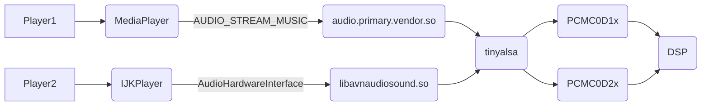

## 一、Android音频框架概述

### 1、Hardware层

**S/PDIF**(Sony/Philips Digital Interface Format)是一种数字传输接口，可使用光纤或同轴电缆输出，把音频输出至解码器上，能保持高保真度的输出结果。S/PDIF能以单线传输音频数据。

![SPDIF原理图][spdif_schematic_demo]

S/PDIF接口采用的是**IEC958**标准，该标准使用**BMC**(Biphase Mask Code)编码，其格式如下：

![IEC958编码][iec958_biphase_mask_encoding]

其原理是使用一个两倍于传输位率(Bit Rate)的Clock做为基准，把原本一位数据拆成两部份，当数据为1的时候在其时钟周期内转变一次电平(0->1或1->0)让Data变成两个不同电平的Data，变成10或01，而当Data为0时则不转变电平，变成11或00。同时每一个位开头的电平与前一个位结尾电平要不同，这样接收端才能判别每一个位的边界。

IEC958标准传输双声道信号的协议架构如下图所示，最上面为由192个帧(Frame)构成的块(Block)。而每个帧储存了两个声道的一组采样(Sample)，分为Channel A和Channel B两个声道，也就是说一个帧(Frame)包含两个子帧(Sub Frame)：

![IEC958数据块][iec958_one_block]

每组采样由一个子帧(Sub Frame)构成，子帧(Sub Frame)数据长度为32Bits，包含了帧头(Preamble)、辅助数据(Aux Data)、音频数据(Audio Data)和四位校验码(Checksum)：

![IEC958子帧][iec958_sub_frame]

也就是说，一个子帧(Sub Frame)为4 Bytes，一个帧(Frame)为8 Bytes，一个块(Block)为192x8=1536 Bytes。

**I2S**(Integrated Interchip Sound)是IC间传输数字音频数据的一种接口标准，采用串行的方式传输2组（左右声道）数据。

![I2S原理图][i2s_schematic_demo]

一般I2S包含如下几条传输线：

	1. 比特时钟 (BCLK: bit clock)
		标准名称为 连续串行时钟 (SCK: Continuous Serial Clock)
	2. 左右声道时钟 (LRCLK: left-right clock)
		标准名称为 字符选择 (WS: word select)，也称为 帧同步 (FS: Frame Sync)
		0表示左频道, 1表示右频道
	3. 串行数据 (SD: Serial Data)
		也称之为 复合数据 (SDATA: multiplexed data)，但也可称为SDATA，SDIN，SDOUT，DACDAT，ADCDAT..
		有一条或者多条串行数据线
	4. 主时钟 (MCLK: Master Clock)
		不是I2S标准的一部分，但通常应用以使音频 CODEC 芯片与主控制器之间能够更好的同步
		f_MCLK=256 x f_LRCLK 或者 f_MCLK=384 x f_LRCLK

![I2S时序图][i2s_timing]

I2S的数据是从高比特（MSB）发送至低比特（LSB），从`LRCLK`的左端开始，加上一个`BCLK`的延迟，即数据将比`LRCLK`要慢一个`BCLK`。也有左对齐（Left Justified）的I2S数据流，它没有`BCLK`的延迟，数据和`LRCLK`是同步的。右对齐（Right Justified）则是数据比`LRCLK`快一个`BCLK`。

![I2S常见时序图-OPENEDV][i2s-normal-timing-by-openedv]

随着技术的发展，在统一的 I2S 接口下，出现了不同的数据格式，根据 DATA 数据相对于`LRCLK`和`BCLK`位置的不同，出现了左对齐(Left Justified)和右对齐(Right Justified)两种格式，这两种格式的时序图如上*（左右声道标识错了）*。常用的是左对齐形式的时序。

---

**DAI/SSI/SAI/ESAI**是SOC中常用的I2S外设，只是根据不同的芯片厂商有不同的名字和含义。

**ASRC**


---

**PCM**(Pulse Code Modulation)脉冲编码调制

![PCM采样][pcm_quantization]


**DSD**(Direct Stream Digital)直接比特流数字

![DSD采样][dsd_quantization]


---

**Dolby Digital Surround**[杜比环绕声立体声](https://www.dolby.com/)

![杜比LOGO][dolby_logo]

**DTS Digital Surround**[DTS环绕声立体声](https://dts.com/)

![DTS LOGO][dts_listen_logo]

---

参考文档：

[SPDIF数字传输接口](https://wenku.baidu.com/view/da86078271fe910ef12df8ea.html)

[I²S](https://en.wikipedia.org/wiki/I%C2%B2S)

[DSD vs PCM：迷思与真相](http://jandan.net/p/98105)

《【正点原子】I.MX6U嵌入式Linux驱动开发指南V1.5.pdf》

### 2、Linux层

**ALSA**(Advanced Linux Sound Architecture)模型


---


**DAPM**(Dynamic Audio Power Management)

参考文档：

[Linux audio驱动模型](https://www.cnblogs.com/linhaostudy/p/8169383.html)

### 3、HAL层

在HAL层中，通过调用`tinyalsa`的方式，将Linux层的声卡文件节点封装为系统可调用的声卡动态库，如下：

```text
/system/lib/hw/audio.a2dp.default.so
/system/lib/hw/audio.usb.default.so
/system/lib/hw/audio.primary.default.so
/system/lib/hw/audio.primary.{vendor}.so
/system/lib/hw/audio.xxxx.{vendor}.so
```

以声卡`audio.primary.imx.so`源码为例：

```cpp
static struct hw_module_methods_t hal_module_methods = {
    .open = adev_open,
};

struct audio_module HAL_MODULE_INFO_SYM = {
    .common = {
        .tag = HARDWARE_MODULE_TAG,
        .module_api_version = AUDIO_MODULE_API_VERSION_0_1,
        .hal_api_version = HARDWARE_HAL_API_VERSION,
        .id = AUDIO_HARDWARE_MODULE_ID,
        .name = "NXP i.MX Audio HW HAL",
        .author = "The Android Open Source Project",
        .methods = &hal_module_methods,
    },
};
```

函数`adev_open`的功能主要是创建`adev`结构体并将其初始化：

```cpp
static int adev_open(const hw_module_t* module, const char* name,
                     hw_device_t** device)
{
    struct imx_audio_device *adev;
    ...
    // 申请内存创建adev
    adev = (struct imx_audio_device *)calloc(1, sizeof(struct imx_audio_device));
    if (!adev)
        return -ENOMEM;

    // 初始化adev中hw_device和其他成员
    adev->hw_device. ... = ....;
    ...
    adev->hw_device.open_output_stream      = adev_open_output_stream;
    ...
    adev->hw_device.open_input_stream       = adev_open_input_stream;
    ...
    // 读取声卡配置文件并选择可用设备
    parse_all_cards(audio_card_list);
    ret = scan_available_device(adev, true, true);
    ...
    // 上锁并设置默认音频路由通道
    pthread_mutex_lock(&adev->lock);
    for(i = 0; i < adev->audio_card_num; i++)
        set_route_by_array(adev->mixer[i], adev->card_list[i]->init_ctl, 1);
    ...
    // 设置当前声卡默认支持的设备
    adev->out_device = AUDIO_DEVICE_OUT_SPEAKER;
    adev->in_device  = AUDIO_DEVICE_IN_BUILTIN_MIC & ~AUDIO_DEVICE_BIT_IN;
    select_output_device(adev);
    ...
    // 解锁并将adev指针赋值到形参
    pthread_mutex_unlock(&adev->lock);
    ...
    *device = &adev->hw_device.common;
    ...
}
```

注意到结构体`adev`中成员的分布如下：

```cpp
// audio_hardware.h
struct imx_audio_device {
    struct audio_hw_device hw_device;
    pthread_mutex_t lock;
    ...
}
```

`**device`获取的其实就是`adev`的地址，后文中对于该指针的强制类型转换也是可行的：

```cpp
// hardware/libhardware/include/hardware/audio.h
struct audio_hw_device {
    struct hw_device_t common;
    ...
    int (*open_output_stream)(struct audio_hw_device *dev,
                              audio_io_handle_t handle,
                              audio_devices_t devices,
                              audio_output_flags_t flags,
                              struct audio_config *config,
                              struct audio_stream_out **stream_out,
                              const char *address);
    ...
    int (*open_input_stream)(struct audio_hw_device *dev,
                             audio_io_handle_t handle,
                             audio_devices_t devices,
                             struct audio_config *config,
                             struct audio_stream_in **stream_in,
                             audio_input_flags_t flags,
                             const char *address,
                             audio_source_t source);
    ...
}
```

再看如何读取并解析声卡配置文件：

```cpp
bool parse_all_cards(struct audio_card **audio_card_list)
{
    ...
    // 打开默认文件夹 /vendor/etc/configs/audio
    vidDir = opendir(g_kAudioConfigPath);
    ...
    // 遍历文件夹
    while ((dirEntry = readdir(vidDir)) != NULL) {
        char config_file[PATH_MAX] = {0};
        // 判断当前文件后缀是否为json
        if(!strstr(dirEntry->d_name, ".json"))
            continue;
        // 生成路径并尝试解析配置文件
        snprintf(config_file, PATH_MAX, "%s/%s", g_kAudioConfigPath, dirEntry->d_name);
        parse_ok = parse_one_card(config_file, &audio_card_list[card_idx]);
        ...
    }
    ...
}
```

声卡配置文件是一个`JSON`文件，其具体格式可以参考[`device/fsl/common/audio-json/readme.txt`](https://source.codeaurora.org/external/imxat/ecockpit/device-fsl/tree/common/audio-json/readme.txt?h=ecockpit_10.0.0_2.1.0-dev)中的说明：

```json
{
    "driver_name": "wm8960-audio",
    "bus_name": "bus1_system_sound_out",
    "supported_out_devices": ["speaker", "wired_headphone", "bus"],
    "supported_in_devices": ["builtin_mic", "wired_headset"],
}
```

其中`driver_name`是默认需要的，`bus_name`主要用于Android Automotive。如果用户自定义了相关输入输出设备，则需要在`audio_card_config_parse.cpp`中添加声明，否则会导致解析失败：

```cpp
static const struct audio_devcie_map g_out_device_map[] = {
    ...
    {"anlg_dock_headset", AUDIO_DEVICE_OUT_ANLG_DOCK_HEADSET},
    {"dgtl_dock_headset", AUDIO_DEVICE_OUT_DGTL_DOCK_HEADSET},
}
```

函数`adev_open_output_stream`的功能主要是创建并初始化`out`结构体，将其指针地址赋值到形参`**stream_out`中去：

```cpp
static int adev_open_output_stream(struct audio_hw_device *dev,
                                   audio_io_handle_t handle __unused,
                                   audio_devices_t devices,
                                   audio_output_flags_t flags,
                                   struct audio_config *config,
                                   struct audio_stream_out **stream_out,
                                   const char* address)
{
    struct imx_audio_device *ladev = (struct imx_audio_device *)dev;
    ...
    // 申请内存创建out
    out = (struct imx_stream_out *)calloc(1, sizeof(struct imx_stream_out));
    ...
    // 根据不同的Flag类型和设备类型配置为不同的参数
    if (flags & AUDIO_OUTPUT_FLAG_COMPRESS_OFFLOAD) {
        ALOGW("%s: compress offload stream", __func__);
        ...
    } else if (flags & AUDIO_OUTPUT_FLAG_DIRECT &&
               devices == AUDIO_DEVICE_OUT_AUX_DIGITAL) {
        ALOGW("adev_open_output_stream() HDMI multichannel");
        ...
    } else if (flags & AUDIO_OUTPUT_FLAG_DIRECT &&
              ((devices == AUDIO_DEVICE_OUT_SPEAKER) ||
               (devices == AUDIO_DEVICE_OUT_LINE) ||
               (devices == AUDIO_DEVICE_OUT_WIRED_HEADPHONE)) &&
               ladev->support_multichannel) {
        ALOGW("adev_open_output_stream() ESAI multichannel");
        ...
    } else {
        ALOGV("adev_open_output_stream() normal buffer");
        ...
    }
    ...
    // 初始化成员
    out->stream.write                       = out_write;
    ...
    // 对形参赋值
    *stream_out = &out->stream;
    ladev->active_output[output_type] = out;
}
```

`**stream_out`获取到的地址就是`out`的地址：

```cpp
// hardware/libhardware/include/hardware/audio.h
struct imx_stream_out {
    struct audio_stream_out stream;
    pthread_mutex_t lock;
    ...
}
```

函数`out_write`的主要功能就是将上层传来的数据通过`tinyalsa`传输到硬件声卡上去：

```cpp
static ssize_t out_write(struct audio_stream_out *stream, const void* buffer,
                         size_t bytes)
{
    struct imx_stream_out *out = (struct imx_stream_out *)stream;
    // 上锁
    pthread_mutex_lock(&adev->lock);
    pthread_mutex_lock(&out->lock);
    // 判断当前输出是否为待机模式
    if (out->standby) {
        // 打开PCM声卡设备
        ret = start_output_stream(out);
        ...
        // 退出待机模式
        out->standby = 0;
        ...
    }
    pthread_mutex_unlock(&adev->lock);
    ...
    // 判断PCM声卡设备是否打开成功
    if (out->pcm) {
        ...
        // 向PCM声卡设备写入数据
        ret = pcm_write_wrapper(out->pcm, (void *)buffer, bytes, out->write_flags);
        ...
    }
exit:
    pthread_mutex_unlock(&out->lock);
    ...
    return bytes;
}
```

在函数`start_output_stream`中主要实现根据相关参数对PCM声卡设备的选择，配置好参数后打开设备：

```cpp
static int start_output_stream(struct imx_stream_out *out)
{
    // 默认PORT = 0
    int card = -1;
    unsigned int port = 0;
    ...
    // 获取声卡编号
    card = get_card_for_device(adev, out->device, PCM_OUT, &out->card_index);
    ...
    // 打开声卡设备
    out->pcm = pcm_open(card, port, flags, config);
    ...
}
```

函数`get_card_for_device`则根据需要的设备类型，遍历所有支持的声卡中的配置数据，找到符合要求的声卡的编号：

```cpp
static int get_card_for_device(struct imx_audio_device *adev, int device, unsigned int flag, int *card_index)
{
    int i;
    int card = -1;

    if (flag == PCM_OUT ) {
        for(i = 0; i < adev->audio_card_num; i++) {
            // 查找匹配的输出声卡设备
            if(adev->card_list[i]->supported_out_devices & device) {
                  card = adev->card_list[i]->card;
                  break;
            }
        }
    } else {
        for(i = 0; i < adev->audio_card_num; i++) {
            // 查找匹配的输入声卡设备
            if(adev->card_list[i]->supported_in_devices & device & ~AUDIO_DEVICE_BIT_IN) {
                  card = adev->card_list[i]->card;
                  break;
            }
        }
    }
    if (card_index != NULL)
        *card_index = i;
    return card;
}
```

同理，也可以从`adev_open_input_stream`函数为入口追踪声卡是如何录音的。

### 4、Framwork层

**AT**(AudioTrack)

---

**AF**(AudioFlinger)

---

**AP**(AudioPolicy)

参考文档：

[第7章 深入理解Audio系统](https://www.kancloud.cn/alex_wsc/android_depp/412851)


### 5、Applicant层


## 二、多声卡方案概述

### 1、其他可参考方案

采用`IJKPlayer`直接调用HAL层中自定义的一个动态库。该动态库通过调用`tinyalsa`的方式，实现了对Linux声卡的基本操作：

```cpp
status_t AudioHardwareStub::open(void)
status_t AudioHardwareStub::close(void)
status_t AudioHardwareStub::start(void)
void AudioHardwareStub::stop(void)
ssize_t AudioHardwareStub::write(const void* buffer, size_t size)
ssize_t AudioHardwareStub::read(const void* buffer, size_t size)
void AudioHardwareStub::flush(void)
void AudioHardwareStub::pause(void)
void AudioHardwareStub::setSampleRate(int sampleRate)
void AudioHardwareStub::setChannelCount(int channel)
void AudioHardwareStub::setFrameSize(int framesize)
int AudioHardwareStub::getPcmFramesToBytes(void)
int AudioHardwareStub::getPcmBufferSize(void)
AudioHardwareInterface AudioHardwareStub::create(void)
```

用户在调用`IJKPlayer`创建播放器的时候，其音频通道已确定。多媒体输出情况下，如果因实际输出导致的与系统播放器之间存在复用音频的情况，往往需要APP应用实现开启、关闭播放器的操作，上层功能逻辑的实现往往会非常复杂。


```mermaid
graph LR
A[Player1] -->B(MediaPlayer) -->|AUDIO_STREAM_MUSIC| C(audio.primary.vendor.so) -->T(tinyalsa) -->P1(PCMC0D1x) -->DSP(DSP)
X[Player2] -->Y(IJKPlayer) -->|AudioHardwareInterface| Z(libavnaudiosound.so) -->T(tinyalsa) -->P2(PCMC0D2x) -->DSP(DSP)
```

### 2、声卡及音频流映射方案

| 流的类型 | 执行策略 | 输出设备 | 声卡设备 | 功能 |
| - | - | - | - | - |
|蓝牙电话| / | / | PCMC0D0 | / |
|AUDIO_STREAM_ALARM | STRATEGY_SUB | AUDIO_DEVICE_OUT_DGTL_DOCK_HEADSET | PCMC0D1 | 媒体1 |
|AUDIO_STREAM_NOTIFICATION | STRATEGY_MINOR | AUDIO_DEVICE_OUT_ANLG_DOCK_HEADSET | PCMC0D2 | 媒体2 |
|AUDIO_STREAM_MUSIC/SYSTEM | STRATEGY_MEDIA |	AUDIO_DEVICE_OUT_SPEAKER | PCMC0D3 | 导航 |


## 三、功能实现方案

### 1、Android4.4 方案实现

参考文档：

[android6.0 framework修改使用两个声卡](https://blog.csdn.net/liujianganggood/article/details/51564972)


### 2、Android10 方案实现


## 四、Automotive 方案

![音频流路由到不同的声卡上][routing_audio_stream_to_different_sound_cards]

参考文档：

NXP《Android_User's_Guide.pdf》

[Android Q CarAudio 汽车音频学习笔记](https://blog.csdn.net/sinat_18179367/article/details/103875807)


[spdif_schematic_demo]: /images/spdif_schematic_demo.png
[iec958_biphase_mask_encoding]: /images/iec958_biphase_mask_encoding.png
[iec958_one_block]: /images/iec958_one_block.png
[iec958_sub_frame]: /images/iec958_sub_frame.png
[i2s_schematic_demo]: /images/i2s_schematic_demo.png
[i2s_timing]: /images/i2s_timing.svg.png
[i2s-normal-timing-by-openedv]: /images/i2s-normal-timing-by-openedv.png
[pcm_quantization]: /images/pcm_quantization.jpg
[dsd_quantization]: /images/dsd_quantization.jpg
[dolby_logo]: /images/dolby-logo.jpg
[dts_listen_logo]: /images/dts-listen-logo.jpg
[routing_audio_stream_to_different_sound_cards]: /images/routing_audio_stream_to_different_sound_cards.png
